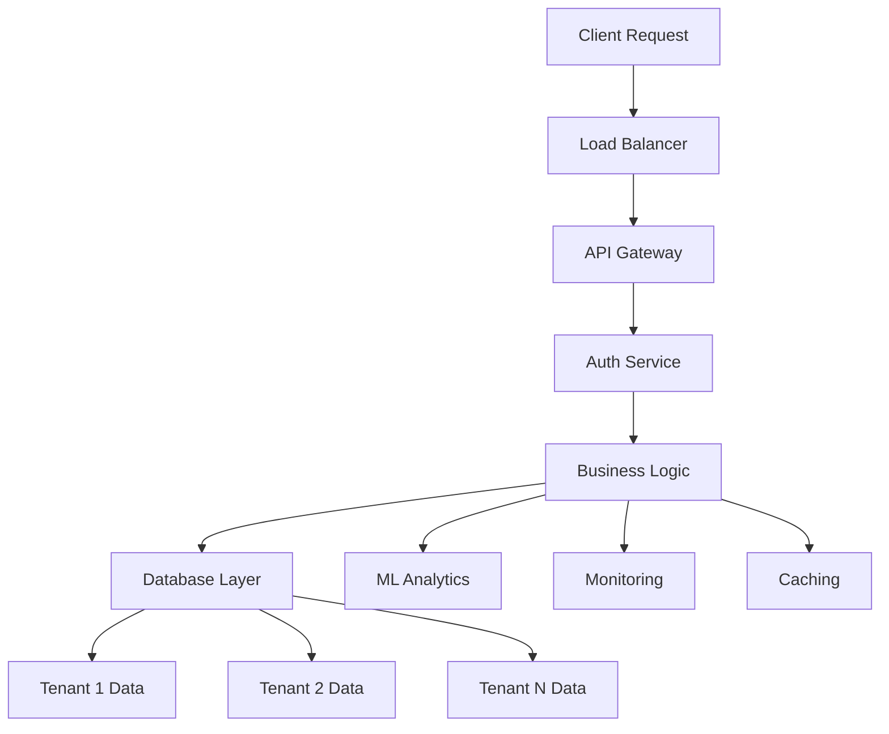

# 🏢 VaultSphere - Enterprise Multi-Tenant SaaS Platform

[](https://opensource.org/licenses/MIT)
[](https://nodejs.org/)
[](https://reactjs.org/)
[](https://www.postgresql.org/)
[](https://aws.amazon.com/)

> **Enterprise-grade multi-tenant SaaS platform with ML-powered security, real-time analytics, and production-ready infrastructure**

## 🎯 Overview

VaultSphere is a complete, production-ready multi-tenant SaaS platform that demonstrates enterprise-grade architecture with modern technologies. Built for scalability, security, and performance, it serves as a comprehensive template for building cloud-native applications.

### 🚀 **Key Highlights**

- **🔐 ML-Powered Security**: Real-time anomaly detection and intrusion prevention
- **📊 Intelligent Analytics**: Multi-tenant dashboards with predictive insights
- **⚡ Auto-Scaling Infrastructure**: Cloud-native deployment with zero-downtime updates
- **🛡️ Enterprise Security**: Multi-factor authentication, data encryption, and audit trails
- **🌍 Global Ready**: CDN, multi-region deployment, and internationalization support

## 🔥 Features

### ✅ **Core Platform Features**
- **🔐 JWT Authentication** with MFA support and secure token rotation
- **🏢 Multi-Tenant Architecture** with complete data isolation
- **👥 Role-Based Access Control** (Admin, Food Company, IT Company)
- **📱 Responsive Design** with dark theme and modern UI
- **⚡ Real-time Updates** with WebSocket integration
- **🌍 Internationalization** ready for global deployment

### 🔒 **Advanced Security**
- **🤖 ML-Powered Anomaly Detection** using LSTM Autoencoders
- **🛡️ Intrusion Detection System** with behavioral analysis
- **🔑 Multi-Factor Authentication** with TOTP support
- **📊 Comprehensive Audit Logs** for compliance and forensics
- **🔒 Data Encryption** at rest and in transit
- **🌐 CORS Protection** with strict origin validation

### 📊 **Intelligent Analytics**
- **📈 Predictive Analytics** with Linear Regression models
- **🎯 Anomaly Detection** using Isolation Forest algorithms
- **💰 Cost Optimization** with Random Forest regression
- **👥 Tenant Segmentation** via K-Means clustering
- **🌍 Global Insights** with multi-tenant performance dashboards
- **⚡ Real-time Monitoring** with live data streams

### 🚀 **Enterprise Infrastructure**
- **☁️ AWS Cloud Deployment** with auto-scaling groups
- **🔄 CI/CD Pipeline** with blue-green deployment
- **📈 Performance Monitoring** with Prometheus & Grafana
- **🚨 Alert System** with PagerDuty integration
- **💾 Database Optimization** with read replicas
- **⚡ CDN Integration** for global content delivery

## 🛠️ Tech Stack

### **Frontend** 🎨
```javascript
React 18 • TypeScript • TailwindCSS • Redux Toolkit
React Router • Axios • Recharts • React Query
Lucide Icons • Framer Motion • Webpack
```

### **Backend** ⚙️
```javascript
Node.js • Express.js • PostgreSQL • JWT
bcryptjs • CORS • Helmet.js • Winston
Redis • Socket.io • Mocha • Supertest
```

### **Machine Learning** 🤖
```python
Python • TensorFlow • Scikit-learn • Pandas
NumPy • Matplotlib • Jupyter Notebooks
LSTM Autoencoders • Isolation Forest • K-Means
```

### **Infrastructure** ☁️
```yaml
AWS EC2 • AWS S3 • AWS RDS • AWS CloudFront
AWS Lambda • AWS VPC • AWS SNS • AWS Secrets Manager
Terraform • Docker • Kubernetes • GitHub Actions
```

### **Monitoring** 📊
```yaml
Prometheus • Grafana • ELK Stack • AWS CloudWatch
AWS X-Ray • PagerDuty • New Relic • Datadog
```

## 🚀 Quick Start

### **Prerequisites**
- [Node.js](https://nodejs.org/) 16+ and npm
- [PostgreSQL](https://www.postgresql.org/) 13+
- [AWS CLI](https://aws.amazon.com/cli/) configured
- [Git](https://git-scm.com/) for version control

### **1. Clone & Setup**
```bash
# Clone the repository
git clone https://github.com/vatspratapsingh/VaultSphere.git
cd VaultSphere

# Install dependencies
npm run setup
```

### **2. Environment Configuration**
```bash
# Backend configuration
cd backend
cp .env.example .env
# Edit .env with your database credentials

# Frontend configuration  
cd ../frontend
cp .env.example .env
# Configure API endpoints
```

### **3. Database Setup**
```bash
# Create database
createdb vaultsphere

# Initialize with demo data
cd backend
npm run init-db
```

### **4. Start Development Servers**
```bash
# Start backend server
cd backend
npm start

# Start frontend server (new terminal)
cd frontend
npm start
```

**🌐 Application will be available at:**
- Frontend: http://localhost:3000
- Backend API: http://localhost:5001

## 🔐 Demo Credentials

### **System Administrator**
- **Email**: `admin@vaultsphere.com`
- **Password**: `admin123`
- **Role**: Full system access with tenant management

### **Food Company User**
- **Email**: `food@vaultsphere.com`
- **Password**: `food123`
- **Role**: Food industry dashboard with supply chain analytics

### **IT Company User**
- **Email**: `it@vaultsphere.com`
- **Password**: `it123`
- **Role**: IT infrastructure dashboard with security analytics

## 📁 Project Structure

```
VaultSphere/
├── 📱 frontend/                 # React SPA Application
│   ├── 🎨 src/
│   │   ├── 🧩 components/       # Reusable UI components
│   │   │   ├── 🔐 auth/         # Authentication components
│   │   │   ├── 📊 dashboards/   # Role-specific dashboards
│   │   │   └── 📈 AnalyticsDashboard.js
│   │   ├── 🎯 contexts/         # React context providers
│   │   ├── 🎪 App.js           # Main application component
│   │   └── 🎨 index.css        # Global styles
│   └── 📦 package.json
├── ⚙️ backend/                  # Express.js API Server
│   ├── 🛣️ routes/              # API route handlers
│   ├── ⚙️ config/              # Configuration files
│   ├── 🗄️ database/            # SQL scripts & migrations
│   ├── 🛡️ middleware/          # Security & auth middleware
│   ├── 📝 scripts/             # Database utilities
│   └── 🚀 server.js            # Main server file
├── ☁️ infrastructure/          # AWS Infrastructure
│   ├── 🏗️ terraform/           # Infrastructure as Code
│   ├── 🐳 docker/              # Container configurations
│   └── 🚀 k8s/                 # Kubernetes manifests
├── 🤖 ml-models/               # Machine Learning Models
│   ├── 📊 anomaly_detection.py # LSTM Autoencoder
│   ├── 🎯 clustering.py        # K-Means segmentation
│   └── 📈 forecasting.py       # Time series prediction
├── 📋 scripts/                 # Deployment & utility scripts
├── 📚 docs/                    # Documentation
├── 🔄 .github/workflows/       # CI/CD Pipeline
└── 📖 README.md                # This file
```

## 🌐 API Documentation

### **Authentication Endpoints**
```http
POST /api/auth/login     # User authentication
POST /api/auth/signup    # User registration
POST /api/auth/logout    # Secure logout
GET  /api/auth/verify    # Token validation
```

### **User Management**
```http
GET    /api/users        # List users (tenant-scoped)
POST   /api/users        # Create user
PUT    /api/users/:id    # Update user
DELETE /api/users/:id    # Delete user
```

### **Tenant Operations**
```http
GET    /api/tenants      # List tenants (admin only)
POST   /api/tenants      # Create tenant
PUT    /api/tenants/:id  # Update tenant
DELETE /api/tenants/:id  # Delete tenant
```

### **Task Management**
```http
GET    /api/tasks        # List tasks (tenant-scoped)
POST   /api/tasks        # Create task
PUT    /api/tasks/:id    # Update task
DELETE /api/tasks/:id    # Delete task
```

### **Analytics & ML**
```http
GET /api/analytics/:tenantId    # ML-powered insights
GET /api/analytics/forecast     # Predictive analytics
GET /api/analytics/anomalies    # Security alerts
GET /api/analytics/clustering   # Tenant segmentation
```

## 🏗️ Architecture Overview

### **Multi-Tenant Design**


### **Security Layers**
- **🔐 Authentication**: JWT with refresh token rotation
- **🛡️ Authorization**: Role-based access control (RBAC)
- **🔒 Data Isolation**: Tenant-scoped database queries
- **🌐 Network Security**: VPC, security groups, and ACLs
- **📊 Audit Trail**: Comprehensive logging and monitoring

## 🚀 Deployment

### **Local Development**
```bash
# Full development setup
npm run dev

# Individual services
npm run backend:dev
npm run frontend:dev
```

### **Production Deployment**
```bash
# AWS Infrastructure
cd infrastructure/terraform
terraform init
terraform apply

# Deploy Application
./scripts/deploy.sh

# Monitor Deployment
./scripts/check-status.sh
```

### **Docker Deployment**
```bash
# Build containers
docker-compose build

# Run services
docker-compose up -d

# Monitor logs
docker-compose logs -f
```

## 📊 Performance & Monitoring

### **Key Metrics**
- **⚡ Response Time**: < 200ms for 95% of requests
- **🔄 Uptime**: 99.9% availability target
- **👥 Concurrent Users**: Support for 10,000+ users
- **💾 Database Performance**: < 50ms query response time

### **Monitoring Stack**
- **📈 Prometheus**: Metrics collection and alerting
- **📊 Grafana**: Real-time dashboards and visualization
- **🔍 ELK Stack**: Log aggregation and analysis
- **🚨 PagerDuty**: Incident management and notifications

## 🧪 Testing Strategy

### **Test Coverage**
```bash
# Unit Tests
npm run test:unit

# Integration Tests
npm run test:integration

# E2E Tests
npm run test:e2e

# Performance Tests
npm run test:performance
```

### **Quality Assurance**
- **✅ Code Coverage**: > 85% test coverage required
- **🔍 Security Scanning**: OWASP dependency checks
- **🎨 Code Quality**: ESLint, Prettier, and SonarQube
- **🔒 Security Testing**: SAST and DAST scanning

## 🔄 CI/CD Pipeline

### **GitHub Actions Workflow**
```yaml
stages:
  - code-quality: ESLint, Prettier, Security scans
  - unit-tests: Jest, Mocha test suites
  - integration-tests: API and database tests
  - build: Docker image creation
  - deploy: Blue-green deployment
  - monitor: Health checks and alerting
```

### **Deployment Strategy**
- **🔄 Blue-Green Deployment**: Zero-downtime updates
- **🎯 Canary Releases**: Gradual feature rollout
- **🔙 Automated Rollbacks**: On failure detection
- **📊 Performance Monitoring**: Real-time metrics

## 📈 Machine Learning Features

### **Anomaly Detection**
- **🤖 LSTM Autoencoders**: Detect unusual user behavior patterns
- **📊 Isolation Forest**: Identify outliers in resource usage
- **🚨 Real-time Alerts**: Immediate notification of suspicious activities

### **Predictive Analytics**
- **📈 Linear Regression**: Forecast resource utilization
- **🎯 Random Forest**: Predict cost optimization opportunities
- **👥 K-Means Clustering**: Segment tenants by usage patterns

### **Security Intelligence**
- **🔍 Behavioral Analysis**: Learn normal user patterns
- **🛡️ Threat Detection**: Identify potential security breaches
- **📊 Risk Scoring**: Calculate security risk levels

## 🌍 Production Features

### **Scalability**
- **🔄 Auto-Scaling**: Dynamic resource allocation
- **💾 Database Optimization**: Read replicas and connection pooling
- **⚡ Caching Strategy**: Redis for frequently accessed data
- **🌐 CDN Integration**: Global content delivery

### **Reliability**
- **🔄 Health Checks**: Automated service monitoring
- **📊 Performance Metrics**: Real-time system monitoring
- **🚨 Alert System**: Proactive issue detection
- **💾 Backup Strategy**: Automated data backups

### **Security**
- **🔐 Encryption**: Data at rest and in transit
- **🛡️ Network Security**: VPC and security groups
- **📊 Audit Logs**: Comprehensive activity tracking
- **🔒 Compliance**: SOC 2, GDPR ready

### **Development Workflow**
1. Fork the repository
2. Create a feature branch (`git checkout -b feature/amazing-feature`)
3. Commit your changes (`git commit -m 'Add amazing feature'`)
4. Push to the branch (`git push origin feature/amazing-feature`)
5. Open a Pull Request

### **Code Standards**
- **🎯 Follow ESLint configuration**
- **🎨 Use consistent formatting with Prettier**
- **✅ Write tests for new features**
- **📝 Update documentation for API changes**

## 📚 Documentation

- **📖 [API Documentation](docs/api.md)** - Complete API reference
- **🏗️ [Architecture Guide](docs/architecture.md)** - System design details
- **🚀 [Deployment Guide](docs/deployment.md)** - Production setup
- **🔧 [Development Guide](docs/development.md)** - Local development setup
- **📊 [Monitoring Guide](docs/monitoring.md)** - Observability setup

## 👨‍💻 Authors

- **Vats Pratap Singh** - [GitHub](https://github.com/vatspratapsingh)
  - Full-stack development
  - ML model integration
  - Cloud infrastructure design


## 🙏 Acknowledgments

- **AWS** for cloud infrastructure and services
- **React & Node.js communities** for excellent frameworks
- **Machine Learning community** for open-source algorithms
- **GitHub** for hosting and CI/CD platform

---

## 🚀 Ready for Production!

**VaultSphere is production-ready with:**

✅ **Enterprise Security** - Multi-factor auth, encryption, audit trails  
✅ **Scalable Infrastructure** - Auto-scaling, load balancing, CDN  
✅ **ML-Powered Analytics** - Real-time insights and predictions  
✅ **Comprehensive Monitoring** - Performance tracking and alerting  
✅ **CI/CD Pipeline** - Automated testing and deployment  
✅ **Multi-Tenant Architecture** - Complete data isolation  
✅ **Professional Documentation** - Complete setup and API guides  

**[⭐ Star this repository](https://github.com/vatspratapsingh/VaultSphere) if you found it helpful!**

**[🚀 Deploy to AWS](scripts/deploy.sh) in minutes!**
